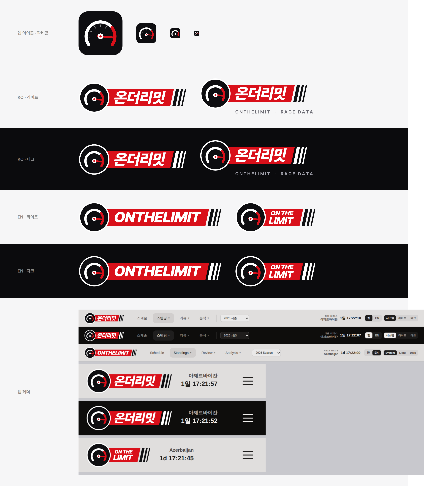

# 온더리밋 (OnTheLimit) 로고



## 콘셉트

- **엠블럼:** 원형 회전계 안에서 바늘이 레드존에 들어가 있습니다. "한계에서(On the limit)" 달린다는 이름을 그대로 그림으로 옮겼습니다.
- **플레이트:** 기울어진 빨간 번호판 위에 워드마크를 흰색으로 넣고, 뒤쪽에 스피드 스트라이프 세 줄을 붙였습니다. 엠블럼이 플레이트 앞쪽에 겹쳐 올라가서, 글자를 나열한 모양이 아니라 한 덩어리의 배지로 읽힙니다.
- **색상**

  | 이름 | 값 | 쓰는 곳 |
  | --- | --- | --- |
  | Racing Red | `#D9101A` | 플레이트, 레드존, 바늘 |
  | Ink | `#111114` | 스트라이프 (라이트 배경) |
  | Tile | `#0E0E11` | 엠블럼 바탕, 앱 아이콘 |
  | Paper | `#FFFFFF` | 워드마크, 엠블럼 테두리, 스트라이프 (다크 배경) |

  빨강은 F1 공식 브랜드 컬러와 일부러 다르게 잡았습니다. 로고에는 "F1" 글자를 쓰지 않습니다.
- **서체:** Pretendard Black / Bold (SIL OFL 1.1). 글자를 모두 윤곽선 경로로 바꿔 두었기 때문에, 이 서체가 설치되지 않은 환경에서도 똑같이 보입니다.

## 파일 (`client/public/brand/`)

| 파일 | 용도 |
| --- | --- |
| `onthelimit-logo-ko-{light,dark}.svg` | **기본 로고.** 앱 헤더(데스크탑 48px, 모바일 52px)에 씁니다. |
| `onthelimit-logo-ko-tagline-{light,dark}.svg` | 태그라인(ONTHELIMIT · RACE DATA)이 들어간 버전. 랜딩 화면, 푸터, 발표 자료처럼 크게 쓸 때 씁니다. |
| `onthelimit-logo-en-{light,dark}.svg` | 영문 UI(데스크탑), SNS |
| `onthelimit-logo-en-stacked-{light,dark}.svg` | 영문 UI의 **모바일 헤더용**. `ON THE / LIMIT`을 두 줄로 쌓아서 폭이 좁습니다. |
| `onthelimit-mark.svg`, `onthelimit-mark-{512,192}.png`, `apple-touch-icon.png` | 앱 아이콘, PWA 아이콘, SNS 프로필 이미지 |
| `favicon.svg`, `favicon-{32,16}.png` | 파비콘. 작은 크기에서도 보이도록 눈금을 빼고 선을 굵게 만들었습니다. |
| `*@2x.png` | SVG를 쓸 수 없는 곳에 넣는 2배 해상도 PNG |

`light`와 `dark`는 스트라이프 색만 다릅니다. 밝은 배경용은 검정, 어두운 배경용은 흰색입니다. 빨간 플레이트와 엠블럼은 두 버전이 같습니다.

### 앱에 적용된 방식

- 헤더(`client/src/App.tsx`)에는 테마별로 `<picture>`를 하나씩 두고, CSS가 현재 테마(시스템/라이트/다크)에 맞는 쪽만 보여 줍니다.
- 화면 폭이 768px 이하일 때는 모바일용 파일을 씁니다. 영문 UI라면 두 줄 버전이 나옵니다.
- 모바일 헤더(72px)에서는 위아래에 10px씩 여백을 두고, 로고가 높이 52px로 헤더를 꽉 채웁니다.

### 사용 규칙

- 로고 둘레에는 엠블럼 지름의 1/4 이상 여백을 둡니다.
- 로고를 늘이거나, 색을 바꾸거나, 엠블럼과 플레이트를 따로 떼어 쓰지 않습니다.
- 높이 32px 미만으로 줄여야 하는 곳에는 로고 대신 앱 아이콘이나 파비콘을 씁니다.

## 다시 만들기

```bash
python3 brand/make_logo.py      # SVG 생성. 필요한 것: fontTools, ~/.fonts/Pretendard-*.otf
node brand/export_png.cjs       # PNG 생성. 필요한 것: Playwright + Chromium
```
