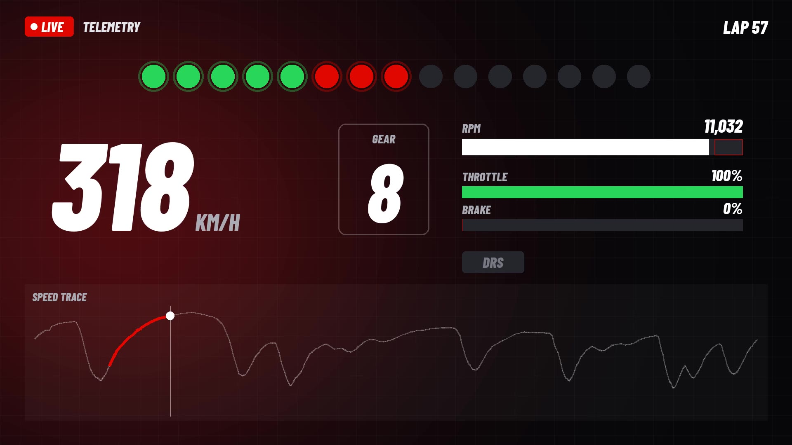

# 온더리밋 홍보 영상

## 현재 버전 — `onthelimit-promo-v5.mp4`

[`RULES.md`](RULES.md)를 따라 만든 영상입니다.

- **길이·형식:** 1920×1080, 30fps, H.264 + AAC, **정확히 90.00초**
- **녹화:** main `1bf3421` 기준, 라이트 테마, 실제 2026 시즌 데이터(14라운드 스페인 GP)
- **브랜드:** 서비스명은 **온더리밋**이고, 타이틀과 아웃트로에 배지 로고를 씁니다. 영상 어디에도 "F1" 표기가 없고, 주소창에는 "온더리밋"이 나옵니다.
- **서체:** 한글 제목은 여기어때 잘난체 2, 영문 강조는 Barlow Condensed ExtraBold Italic, 본문은 Pretendard입니다.
- **음악:** 곡 하나를 자르거나 이어 붙이지 않고 그대로 씁니다. 리미터 컷(3.0초)에 시작해서, 곡의 원래 엔딩이 영상 끝에 오도록 배치했습니다.
- **아웃트로:** 기술 스택을 넣지 않고, 크레딧은 출처 표기가 필요한 CC BY 사진만 적었습니다.

| 시간 | 내용 |
| --- | --- |
| 0:00–0:03 | **텔레메트리 오프닝.** 앱이 받은 실제 데이터로 만든 화면입니다. 스페인 GP 57랩 최속랩의 가장 긴 풀스로틀 직선에서 시프트 라이트, 속도, 기어, RPM, 스로틀·브레이크, DRS, 속도 그래프가 움직입니다. 3단에서 8단까지 실제 변속 시점마다 변속음이 나고, 리미터에서 시프트 라이트가 파랗게 깜빡이며 **ON THE LIMIT**이 뜹니다. 타이밍 타워와 선수 정보는 넣지 않았습니다. |
| 0:03–0:11 | 리미터 컷과 함께 음악이 시작 → 2비트마다 넘어가는 사진 몽타주 → 배지 로고 타이틀 |
| 0:11–0:51 | **모바일:** 손 안의 온더리밋 → 스케줄(다음 레이스로 이동) → 스탠딩 → 결과 → 타임라인·리플레이 → 텔레메트리 → 인시던트 |
| 0:51–0:54 | "데스크탑에서는 더 넓게, 한눈에." 전환 |
| 0:54–1:17 | **데스크탑:** 드라이버 스탠딩 → 타임라인·리플레이 → 텔레메트리 → 스케줄 |
| 1:17–1:22 | 같은 스탠딩을 모바일과 데스크탑에서 비교 |
| 1:22–1:30 | 아웃트로: 로고, 기능 목록, 사진 크레딧 |

## 사용한 소스와 라이선스

| 요소 | 출처 | 라이선스 |
| --- | --- | --- |
| 앱 화면 | 이 저장소의 앱을 Playwright(Chromium)로 직접 녹화 | 자체 제작 |
| 오프닝 텔레메트리 화면, 프레임, 전환 그래픽 | 편집 스크립트에서 Pillow로 그림. 데이터는 앱 API(Jolpica-F1, FastF1) | 자체 제작 |
| 배경 음악 | Mixkit "Infected Mushroom Vibes" | Mixkit Stock Music Free License |
| 효과음 | Mixkit: Racing motorcycle speeding up, Motorcycle changing gears, Fast car drive by, Fast whoosh transition, Cinematic whoosh fast transition, Movie impact intro presentation, Epic movie trailer whoosh impact | Mixkit Sound Effects Free License |
| 사진 | Flickr(Openverse에서 검색), 아래 표 참고 | CC BY 2.0 |
| 로고 | `client/public/brand/` 배지 로고 | 자체 제작 |
| 서체 | 여기어때 잘난체 2 / Barlow Condensed / Pretendard | 여기어때 잘난체 라이선스(영상 사용 가능) / SIL OFL 1.1 / SIL OFL 1.1 |

**사진 출처 (CC BY 2.0).** 원본을 잘라내고 확대했으며, 명암과 채도를 보정했습니다. 영상 아웃트로에도 촬영자와 라이선스를 적었습니다.

| 제목 | 촬영자 | 원본 | 쓰인 곳 |
| --- | --- | --- | --- |
| Seb, doing start pratice at the end of FP3 | franpe | [Flickr](https://www.flickr.com/photos/99725323@N00/8223143223) | 몽타주 |
| Lewis, doing start pratice at the end of FP3 | franpe | [Flickr](https://www.flickr.com/photos/99725323@N00/8224182470) | 몽타주 |
| Button Rocket | polarjez | [Flickr](https://www.flickr.com/photos/46367436@N04/4942337889) | 몽타주 |
| Vettel's 2013 Contender | Michael Elleray | [Flickr](https://www.flickr.com/photos/36021014@N06/8468329710) | 몽타주, "더 넓게" 전환 |
| Formula 1 Circuit of the Americas, November 2013 | nan palmero | [Flickr](https://www.flickr.com/photos/97402086@N00/10948746545) | 몽타주 |
| Vettel | Nick J Webb | [Flickr](https://www.flickr.com/photos/11540081@N05/5765270061) | 몽타주 |
| Vettel on Pole | Michael Elleray | [Flickr](https://www.flickr.com/photos/36021014@N06/8093437730) | 타이틀 배경 |
| Chequered flag flying at Donington | Ben Sutherland | [Flickr](https://www.flickr.com/photos/60179301@N00/14662062161) | 아웃트로 배경 |

> 사진에는 팀·스폰서 로고와 실제 드라이버가 등장합니다. CC BY는 사진의 저작권만 허락하는 라이선스이고, 상표권이나 초상권까지 허락하지는 않습니다. 광고처럼 상업적으로 쓸 계획이라면 따로 확인하는 것이 좋습니다.

내려받은 음원·사진·폰트 원본은 저장소에 넣지 않습니다(RULES.md 2·3절).

## 다시 만드는 방법

스크립트는 버전마다 앞 버전을 헬퍼로 가져다 씁니다(v5 → v4 → v3 → v2 → v1). 그래서 `scripts/`, `scripts/v2`–`v5`의 파일을 **한 작업 폴더에 모아서** 실행합니다.

1. **API 서버:** `server/`를 복사한 사본에서 `fastf1Service.ts`의 Python 실행 파일만 `python3`로 바꿉니다.
   - 이 환경은 프록시를 거쳐 외부에 접속하기 때문에, 사본의 axios를 1.16.1 이상으로 올려야 합니다.
   - `pip install fastf1`을 실행합니다.
2. **클라이언트:** `cd client && npx vite --port 5173`
3. **서체:** 잘난체 2, Barlow Condensed ExtraBold Italic, Pretendard를 `~/.fonts/`에 설치합니다. 받는 곳은 RULES.md 3절에 있습니다.
4. **소스 준비:** 위 표의 음악, 효과음, 사진을 `media/dl/`에 내려받습니다.
   - `music/136.mp3`
   - `sfx/{2724,2730,1538,1490,1492,2902,2918}.mp3`
   - `img/ov{44,40,89,96,85,106,14,115}.jpg`
5. **녹화:** `node record4.cjs` → `rec4/`
   - 라이트 테마, 데스크탑 1920×1080, 모바일 390×844(DPR 2)
   - 이어서 `python3 toclip4.py`로 `clips4/`를 만듭니다.
6. **오프닝 데이터:** API에서 받아 `v4/`에 저장합니다.
   - `/api/results/2026/14` → `results.json`
   - `/api/telemetry/2026/14/12` → `tel_ant.json`
   - `/api/telemetry/drivers/2026/14` → `drivers.json`
7. **로고 PNG:** `node logo_png.cjs`
8. **합성:** `python3 make_video5.py` → `out/promo_v5.mp4`

## 버전 기록

이전 버전 영상과 대표 이미지는 저장소에서 삭제했습니다(git 기록에는 남아 있습니다).

- **v1:** 코드로 합성한 음악과 샘플 데이터로 만든 첫 소개 영상
- **v2:** 실제 데이터, 다크 테마, 2분 10초
- **v3:** 모바일 우선, 라이트 테마, 90초
- **v4:** RULES.md를 적용하고 라이브 타이밍(타이밍 타워 + 텔레메트리) 오프닝을 넣은 버전
- **v5:** 오프닝을 텔레메트리만 남기도록 바꾼 현재 버전
