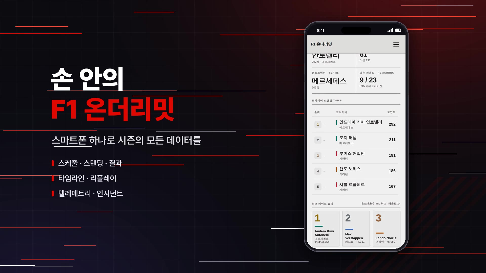

# 온더리밋 홍보 영상

## v4 — `onthelimit-promo-v4.mp4` (최신 · 90초)

[`RULES.md`](RULES.md)를 그대로 따른 첫 영상입니다. main `6d6a4eb` 기준으로 모든 장면을 다시 녹화했습니다.

- **길이·형식:** 1920×1080, 30fps, **정확히 90.00초**
- **녹화:** 라이트 테마, 실제 2026 시즌 데이터(14라운드 스페인 GP)
- **브랜드:** 서비스명은 **온더리밋**이고, 타이틀과 아웃트로에 배지 로고를 씁니다. 영상 어디에도 "F1" 표기가 없고, 주소창에는 "온더리밋"이 나옵니다.
- **서체:** 한글 제목은 여기어때 잘난체 2, 영문 강조는 Barlow Condensed ExtraBold Italic, 본문은 Pretendard입니다.
- **아웃트로:** 기술 스택을 넣지 않고, 크레딧은 출처 표기가 필요한 CC BY 사진만 적었습니다.

| 시간 | 내용 |
| --- | --- |
| 0:00–0:03 | **라이브 타이밍 오프닝.** 앱이 받은 실제 데이터로 만든 중계 스타일 화면입니다. 스페인 GP 최종 순위·격차가 담긴 타이밍 타워 옆에서, 안토넬리의 최속랩(57랩) 텔레메트리 중 가장 긴 풀스로틀 직선을 재생합니다. 3단에서 8단까지 실제 변속 시점마다 변속음이 나고, 속도와 RPM이 오르며 시프트 라이트가 차오릅니다. 리미터에 닿으면 라이트가 파랗게 깜빡이고 **ON THE LIMIT**이 뜹니다. |
| 0:03–0:11 | 리미터 컷과 함께 음악이 시작 → 2비트마다 넘어가는 F1 사진 몽타주 → 배지 로고 타이틀 |
| 0:11–0:51 | **모바일:** 손 안의 온더리밋 → 스케줄(다음 레이스로 이동) → 스탠딩 → 결과 → 타임라인·리플레이 → 텔레메트리 → 인시던트 |
| 0:51–0:54 | "데스크탑에서는 더 넓게, 한눈에." 전환 |
| 0:54–1:17 | **데스크탑:** 드라이버 스탠딩 → 타임라인·리플레이 → 텔레메트리 → 스케줄 |
| 1:17–1:22 | 같은 스탠딩을 모바일과 데스크탑에서 비교 |
| 1:22–1:30 | 아웃트로: 로고, 기능 목록, 사진 크레딧 |

**소스:** 음악은 Mixkit "Infected Mushroom Vibes"입니다. 효과음은 Mixkit의 Racing motorcycle speeding up, Motorcycle changing gears, 휘시, 임팩트를 썼습니다. 사진은 아래 v2 표에 있는 것 중 franpe, polarjez, Michael Elleray, nan palmero, Nick J Webb, Ben Sutherland의 사진입니다. 아날로그 계기판 스톡 영상은 쓰지 않았습니다.

**다시 만드는 방법:** 서버 구성은 v2와 같습니다.
1. `node scripts/v4/record4.cjs` → `rec4/`, `python3 scripts/v4/toclip4.py` → `clips4/`
2. 오프닝 데이터를 받아 `v4/`에 저장합니다.
   - `/api/results/2026/14` → `results.json`
   - `/api/telemetry/2026/14/12` → `tel_ant.json`
   - `/api/telemetry/drivers/2026/14` → `drivers.json`
3. `node scripts/v4/logo_png.cjs`로 로고 PNG를 만듭니다.
4. `python3 scripts/v4/make_video4.py`
   - v1–v3 스크립트를 헬퍼로 가져다 씁니다.
   - 서체 3종이 `~/.fonts/`에 설치되어 있어야 합니다.

---

## v3 — `f1-onthelimit-promo-90s.mp4` (90초 · 모바일 우선)

- 1920×1080, 30fps, H.264 + AAC, **정확히 90.00초**
- 모든 화면을 **라이트 테마**로, 실제 2026 시즌 데이터(14라운드 스페인 GP)를 불러와 녹화했습니다.
- **모바일 장면을 먼저** 보여 주고, 뒤쪽에서 "데스크탑에서는 더 넓게, 한눈에" 구간으로 넘어갑니다.
- 첫 타이틀에서 DESKTOP / MOBILE / 2026 SEASON 칩을 뺐습니다.
- 음악은 곡 **하나**를 자르거나 이어 붙이지 않고 그대로 씁니다. 스타트 라이트가 꺼지는 2.4초에 시작해서, 곡의 원래 엔딩이 영상 끝(약 89초)에 맞게 배치했습니다.

| 시간 | 내용 |
| --- | --- |
| 0:00–0:10 | 회전계와 스타트 라이트(엔진음) → 라이트가 꺼지는 순간 음악 시작 → 2비트마다 넘어가는 F1 사진 몽타주 → "F1 온더리밋" 타이틀 |
| 0:10–0:50 | **모바일:** "손 안의 F1 온더리밋" → 스케줄 → 스탠딩(드로어 메뉴) → 레이스 결과 → 타임라인·리플레이 → 텔레메트리 → 인시던트 |
| 0:50–0:53 | "데스크탑에서는 더 넓게, 한눈에." 폰 비율 프레임이 와이드 화면으로 늘어나는 전환 |
| 0:53–1:16 | **데스크탑:** 드라이버 스탠딩(표와 차트 나란히) → 레이스 타임라인과 리플레이 → 텔레메트리 비교 → 4열 스케줄 |
| 1:16–1:22 | 같은 스탠딩을 모바일과 데스크탑에서 나란히 비교 |
| 1:22–1:30 | 아웃트로(기능 목록, 기술 스택, 크레딧) |

**v3에서 새로 쓴 소스**
- 음악: Mixkit "Infected Mushroom Vibes" (Mixkit Stock Music Free License)

나머지 사진·효과음·스톡 영상은 v2와 같고, 출처는 아래 v2 표에 있습니다. 사진은 v2 표에 있는 것 중 일부만 씁니다.

**다시 만드는 방법:** v2와 같은 서버 구성에서 다음 순서로 실행합니다.
1. `node scripts/v3/record3.cjs` → `rec3/` (라이트 테마, 모바일 390×844)
2. `python3 scripts/v3/toclip3.py` → `clips3/`
3. `python3 scripts/v3/make_video3.py` → `out/promo_v3.mp4`
   - 이 스크립트는 `make_video2.py`와 `make_video.py`를 가져다 씁니다.

---

## v2 — `f1-onthelimit-promo.mp4` (2분 10초 · 다크 테마)

- 1920×1080, 30fps, H.264 + AAC, 약 2분 10초
- 실제 2026 시즌 데이터(Jolpica-F1 API, FastF1)를 불러온 상태에서 녹화했습니다. 화면에 나오는 경기는 14라운드 스페인 그랑프리입니다.
- 브라우저 주소창에는 URL 대신 서비스명 **F1 온더리밋**을 표시합니다.
- 장면마다 번호 말머리 없이 **메뉴명과 기능 설명**만 넣었습니다.

| 구간 | 내용 |
| --- | --- |
| 인트로 | 회전계와 스타트 라이트 → 비트에 맞춘 F1 사진 몽타주 → 타이틀 |
| 대시보드 · 스케줄 | 카운트다운, 시즌 리더, TOP 5, 포디움 / 레이스만 보기와 전 세션 보기 전환 |
| **STANDINGS** 스팅어 → 드라이버 · 컨스트럭터 스탠딩 | 순위 변동 차트, 획득 포인트, 팀 포인트 막대 |
| **REVIEW** 스팅어 → 레이스 결과 · 타임라인 · 리플레이 | 퀄리파잉 탭, 57랩 순위 차트, 480배속 리플레이 |
| **ANALYSIS** 스팅어 → 텔레메트리 · 인시던트 | 두 드라이버 비교(ANT vs VER), 인시던트 밀도, 필터 |
| 라이트/다크 · 한/EN | 테마와 언어 전환 |
| 모바일 | 빛 궤적 영상 전환 → 대시보드, 드로어 메뉴, 리플레이, 결과·텔레메트리, 인시던트 |
| 마무리 | 데스크탑과 모바일 동시 재생 → 체커기 배경의 아웃트로(크레딧 포함) |

### 사용한 소스와 라이선스

| 요소 | 출처 | 라이선스 |
| --- | --- | --- |
| 앱 화면 | 이 저장소의 앱을 Playwright(Chromium)로 직접 녹화 | 자체 제작 |
| 배경 음악 | Mixkit "Games Music"(0–82초), "Trap Electro Vibes"(모바일 구간) | Mixkit Stock Music Free License |
| 효과음 | Mixkit: Racing motorcycle speeding up, Fast car drive by, Fast whoosh transition, Cinematic whoosh fast transition, Movie impact intro presentation, Epic movie trailer whoosh impact, Garage pneumatic screwer | Mixkit Sound Effects Free License |
| 스톡 영상 | Mixkit: Accelerating car dashboard(인트로 회전계), Cars traveling at high speed on a highway at night(모바일 전환) | Mixkit Stock Video Free License (Restricted 라이선스 항목은 쓰지 않음) |
| F1 사진 | Flickr(Openverse에서 검색), 아래 표 참고 | CC BY 2.0 |
| 그래픽 (프레임, 전환, 스팅어, 스타트 라이트) | `scripts/v2/make_video2.py`에서 Pillow로 그림 | 자체 제작 |
| 글꼴 | [Pretendard](https://github.com/orioncactus/pretendard) | SIL Open Font License 1.1 |

**사진 출처 (CC BY 2.0)** — 원본을 잘라내고 확대했으며, 명암과 채도를 보정하고 색조를 입혔습니다. 영상 아웃트로에도 촬영자 이름을 표기했습니다.

| 제목 | 촬영자 | 원본 | 라이선스 |
| --- | --- | --- | --- |
| Vettel on Pole | Michael Elleray | [Flickr](https://www.flickr.com/photos/36021014@N06/8093437730) | CC BY 2.0 |
| Learn from the start. | rarye | [Flickr](https://www.flickr.com/photos/26840420@N05/4491902207) | CC BY 2.0 |
| Lewis, doing start pratice at the end of FP3 | franpe | [Flickr](https://www.flickr.com/photos/99725323@N00/8224182470) | CC BY 2.0 |
| Seb, doing start pratice at the end of FP3 | franpe | [Flickr](https://www.flickr.com/photos/99725323@N00/8223143223) | CC BY 2.0 |
| Sebastian Vettel drifts wide after sustaining a puncture | Ben Sutherland | [Flickr](https://www.flickr.com/photos/60179301@N00/4795171283) | CC BY 2.0 |
| Formula 1 Circuit of the Americas, November 2013 | nan palmero | [Flickr](https://www.flickr.com/photos/97402086@N00/10948746545) | CC BY 2.0 |
| Button Rocket | polarjez | [Flickr](https://www.flickr.com/photos/46367436@N04/4942337889) | CC BY 2.0 |
| Vettel's 2013 Contender | Michael Elleray | [Flickr](https://www.flickr.com/photos/36021014@N06/8468329710) | CC BY 2.0 |
| Force India | worldinframes | [Flickr](https://www.flickr.com/photos/9061964@N06/6315503551) | CC BY 2.0 |
| Vettel | Nick J Webb | [Flickr](https://www.flickr.com/photos/11540081@N05/5765270061) | CC BY 2.0 |
| F1 Virgins | Warren D | [Flickr](https://www.flickr.com/photos/13390389@N08/4691786968) | CC BY 2.0 |
| Chequered flag flying at Donington | Ben Sutherland | [Flickr](https://www.flickr.com/photos/60179301@N00/14662062161) | CC BY 2.0 |

> 사진에는 팀·스폰서 로고와 실제 드라이버가 등장합니다. CC BY는 사진의 저작권만 허락하는 라이선스이고, 상표권이나 초상권까지 허락하지는 않습니다. 광고처럼 상업적으로 쓸 계획이라면 따로 확인하는 것이 좋습니다.

### 다시 만드는 방법 (v2)

1. API 서버: `server/`를 복사한 사본에서 `fastf1Service.ts`의 Python 실행 파일만 `python3`로 바꿉니다. 이 환경은 프록시를 거쳐 외부에 접속해서, 사본의 axios를 1.16.1 이상으로 올려야 합니다. 그리고 `pip install fastf1`을 실행합니다.
2. 클라이언트: `cd client && npx vite --port 5173`
3. 녹화: `node scripts/v2/record2.cjs` → `rec2/`
   - 다크 테마로 녹화하고, 모바일은 390×844 뷰포트(DPR 2)를 씁니다.
4. 클립 변환: `python3 scripts/v2/toclip2.py` → `clips2/`
5. 합성: `python3 scripts/v2/make_video2.py` → `out/promo_v2.mp4`
   - `media/dl/`에 위 음악·효과음·영상·사진이 있어야 합니다.
   - v1의 `make_video.py`를 헬퍼로 가져다 씁니다.

---

## v1 — `f1-dashboard-intro.mp4` (이전 버전)

- 1920×1080, 30fps, 약 1분 57초. 코드 업데이트 이전 UI로 녹화했습니다.
- 녹화 당시에는 네트워크 정책 때문에 외부 API에 접속할 수 없었습니다. 그래서 `scripts/mock-server.cjs`가 만든 **시연용 샘플 데이터**로 촬영했고, 음악·효과음·그래픽도 코드로 직접 합성했습니다(`scripts/music.py`, `scripts/make_video.py`).
- 알려진 문제: 모바일 장면의 녹화 뷰포트(390×664)를 390×844 화면 비율로 늘려서, 모바일 화면이 세로로 약 27% 늘어나 보입니다. v2에서는 이 문제를 고쳤습니다.
- 다시 만드는 방법: `scripts/mock-server.cjs` → `scripts/record.cjs` → `scripts/toclip.py` → `scripts/make_video.py`
