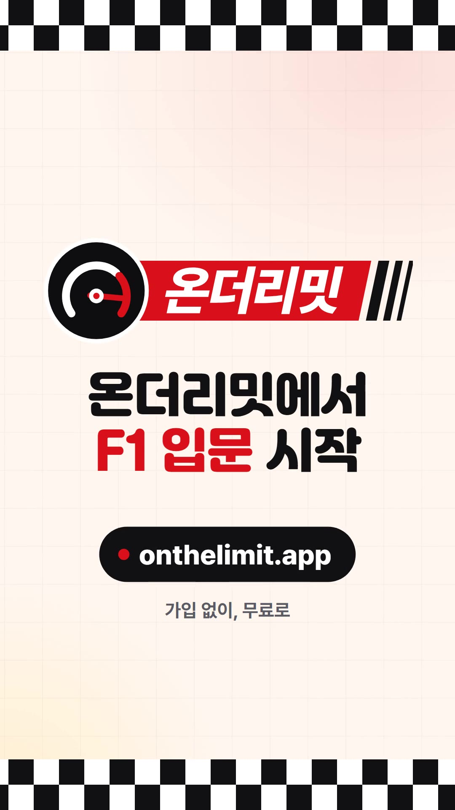

# 온더리밋 쇼츠 (세로 홍보 영상)

인스타 릴스·유튜브 쇼츠용 세로 영상 두 편입니다. F1을 전혀 모르는 사람이 "어, 재밌겠는데?" 하고 멈춰 보도록, 전문용어 없이 친구가 추천하는 말투로 만들었습니다.

| 파일 | 원본 | 길이 | 내용 |
| --- | --- | --- | --- |
| `onthelimit-shorts-v1.mp4` | `index.html` | **26.00초** | 기본 편: 큰 자막 + 폰 목업 + PC 화면 몽타주 |
| `onthelimit-shorts-chat-v1.mp4` | `chat.html` | **22.80초** | 단톡방 편: 친구들 대화 속에서 앱을 소개 |

- **형식:** 1080×1920(9:16), 30fps, H.264 High(yuv420p), AAC
- **음악:** 두 편 모두 Mixkit "Summer's Here"(Ahjay Stelino, 150BPM의 밝고 빠른 곡). 곡의 뒷부분을 자르거나 이어 붙이지 않고 곡의 원래 엔딩까지 씁니다. 박이 0.4초라서 장면 전환과 말풍선이 박 위에 오고, 마무리 와이프는 마디 첫 박, 주소 등장은 곡의 마지막 화음에 맞췄습니다. 시작 지점은 각 HTML의 `window.__MUSIC_START`(기본 편 68.07초, 단톡방 편 71.27초)입니다. 자막만 보고도 이해되게 만든 영상이라 소리를 꺼도 내용이 전달됩니다.
- **원본:** HTML 파일 하나가 영상 한 편입니다. 브라우저로 열면 자동재생하고 끝나면 반복합니다. 처음 누르면 음악과 함께 처음부터 다시 재생하고(`music/music.mp3`가 있을 때), 그다음부터는 일시정지/재생입니다. `?t=12.5`를 붙이면 그 시점에서 멈춘 화면을 봅니다.

## 구성: 기본 편

| 시간 | 화면 | 자막 |
| --- | --- | --- |
| 0:00–0:03 | **훅.** 속도선과 함께 단어가 튀어나오고, 플래시 컷 뒤 큰 글씨 | 요즘 다들 F1 얘기하던데… → 나만 몰라? |
| 0:03–0:07 | **공감.** 말풍선 칩(누가 1등? / 추월했대! / 사고 났대… / 다음 경기는?) → "한눈에"에 형광펜, 폰이 아래에서 올라옴 | 누가 이겼는지, 뭐가 재밌었는지 → 한눈에 보고 싶다면? |
| 0:07–0:10.8 | **01 스케줄.** 다음 레이스 화면에서 카운트다운을 확대하고 "D-5" 스티커 → 세션 일정으로 스크롤 | "다음 경기 언제야?" / 남은 시간까지 바로 확인 |
| 0:10.8–0:14.4 | **02 순위.** 드라이버 스탠딩이 오른쪽에서 밀려 들어오고 1등 줄을 확대, "1등!" 스티커 | "지금 누가 1등이야?" / 선수·팀 순위를 한눈에 |
| 0:14.4–0:18 | **03 레이스 리뷰.** 순위 변동 차트가 랩 순서대로 그려짐 → 레이스 리플레이 33랩의 옐로 플래그를 확대, "여기서 사고!" 스티커 | "경기 안 봐도 무슨 일 있었는지" / 랩마다 바뀐 순위, 한 장에 → 사고 장면도 콕 집어서 |
| 0:18–0:20 | **PC.** 모니터 목업이 커지며 들어오고, 한 박(0.4초)마다 데스크탑 화면이 넘어감: 다음 경기 → 순위 → 스케줄 → 문서 → 타임라인. 아래 칩이 지금 화면을 표시 | +PC에서도 / 큰 화면으로 한눈에! |
| 0:20–0:26 | **마무리.** 체커 깃발 띠, 배지 로고, 곡의 마지막 화음에 맞춰 주소 | 온더리밋에서 F1 입문 시작 / onthelimit.app / 가입 없이, 무료로 |

장면 사이는 빨간 사선 와이프로 넘어갑니다(90초 영상과 같은 전환). 레이싱 요소는 속도선, 사선 와이프, 체커 띠 정도로만 넣었습니다.

## 구성: 단톡방 편

영상 화면 전체가 메신저 단톡방("불금 치맥 모임")입니다. 특정 메신저의 디자인·로고는 쓰지 않고 온더리밋 색으로 그렸고, 친구 이름(민지·준호·서연)은 지어낸 것입니다.

| 시간 | 화면 |
| --- | --- |
| 0:00–0:03.2 | 친구들이 F1 얘기로 떠듦: "어제 F1 봤어?? 🏎️" / "마지막에 역전한 거 실화냐 ㅋㅋㅋ" / "나 소리 질렀잖아 😱" / "다음 경기 언제야? 같이 보자!" |
| 0:03.2–0:04.8 | 화면이 어두워지며 큰 글씨: 요즘 다들 F1 얘기하던데… **나만 몰라?** |
| 0:04.8–0:07.2 | 나: "나 F1 하나도 모르는데… 😢" → 민지: "ㅋㅋ 걱정 마, 여기 보면 돼" + 온더리밋 링크 카드 |
| 0:07.2–0:09.2 | 나: "다음 경기 언제야?" → 다음 레이스 화면 사진, 카운트다운에 "D-5" |
| 0:09.2–0:10.8 | 나: "지금 누가 1등이야?" → 드라이버 순위 사진, "1등!" |
| 0:10.8–0:14.0 | 나: "경기 못 봤는데 무슨 일 있었어?" → "이거 보면 다 알아 👀" + 순위 변동 차트 → 리플레이 33랩 "여기서 사고!" |
| 0:14.0–0:16.8 | 나: "오 이거 완전 편한데?? 😆" → "그치? 이번 주엔 같이 보자 🏁" / "콜!! 🙌" |
| 0:16.8–0:22.8 | 마무리(기본 편과 같음): 로고, 온더리밋에서 F1 입문 시작, onthelimit.app, 가입 없이, 무료로 |

말풍선이 뜨는 시각은 `chat.html` 각 요소의 `data-t`(초)입니다. 말풍선을 바꾸거나 더해도 스크롤은 자동으로 맞춰집니다.

## 소스와 라이선스

| 요소 | 출처 | 라이선스 |
| --- | --- | --- |
| 앱 화면(`img/*.jpg`) | 실서비스 onthelimit.app을 Playwright로 캡처(2026-09-28, 모바일 390×844 DPR 2, 라이트 테마). 데이터는 2026 시즌 15라운드 아제르바이잔 GP 기준 | 자체 제작 |
| 데스크탑 화면(`img/pc-*.jpg`) | 같은 날 1920×1080 라이트 테마로 캡처한 `/next`, `/drivers`, `/schedule`, `/docs`, `/timeline`(레이스 선택, 순위 변동 차트 펼침). 1440×810으로 줄여 저장 | 자체 제작 |
| 로고(`img/logo.svg`) | `client/public/brand/onthelimit-logo-ko-light.svg` 그대로 | 자체 제작 |
| 폰·모니터 목업, 단톡방 화면, 속도선, 와이프, 체커 띠, 스티커 | `index.html`, `chat.html`의 CSS | 자체 제작 |
| 배경 음악 | Mixkit ["Summer's Here"](https://assets.mixkit.co/music/91/91.mp3) (Ahjay Stelino) | Mixkit Stock Music Free License(출처 표기 의무 없음) |
| 서체 | 여기어때 잘난체 2(제목) / Pretendard(본문) / Barlow Condensed ExtraBold Italic(번호) | 여기어때 잘난체 라이선스(영상 사용 가능) / SIL OFL 1.1 / SIL OFL 1.1 |

- 팀 로고, 선수 사진, F1 공식 로고는 쓰지 않았습니다. 앱 화면에 나오는 선수·팀 이름은 글자이고, 팀 색 막대만 있습니다.
- 사진이 없고, 음악은 출처 표기 의무가 없는 Mixkit Free License라서 영상에 넣을 크레딧은 없습니다([RULES.md](../RULES.md) 1·2절).
- 음원 파일(`music/`)은 저장소에 넣지 않습니다. Mixkit 라이선스는 음원을 따로 떼어 재배포하는 것을 금지합니다.
- 폰 목업에는 다이나믹 아일랜드를 넣지 않습니다. 앱 헤더(로고)를 가립니다.
- 자막에 "F1"이 나옵니다. [RULES.md](../RULES.md)는 서비스명에 "F1"을 붙이지 말라는 규칙이고, 여기서는 서비스명(온더리밋)과 따로 "F1 입문"이라는 뜻으로만 씁니다. 공식 로고 모양이 아니라 잘난체 글자입니다.

## 다시 만드는 방법

작업 폴더에 `playwright`를 설치하고 `NODE_PATH`로 가리킵니다. ffmpeg는 PATH에 있거나 `FFMPEG`로 지정합니다.

1. **서체·음악:** `fonts/`와 `music/`에 넣습니다(저장소에는 넣지 않습니다).
   - `Jalnan2TTF.ttf` — https://www.goodchoice.kr/font 에서 받은 잘난체 2
   - `Pretendard-{SemiBold,Bold,ExtraBold,Black}.woff2` — npm `pretendard`의 `dist/web/static/woff2/`
   - `barlow-condensed-latin-800-italic.woff2` — npm `@fontsource/barlow-condensed`의 `files/`
   - 음악: https://assets.mixkit.co/music/91/91.mp3 를 `music/music.mp3`로 저장합니다. 없으면 무음 트랙으로 녹화됩니다.
   - Pretendard와 Barlow는 `fonts/`에 없으면 CDN에서 받습니다. 잘난체가 없으면 Pretendard로 대신 나오니, 녹화 전에 `render.cjs`가 찍는 `fonts:` 줄에 `Jalnan 2`가 있는지 봅니다.
2. **캡처:** `node scripts/capture.cjs` → `shots/`
3. **자르기:** `shots/`의 2배 해상도 PNG를 JPEG(품질 90)로 `img/`에 저장합니다.
   - `header.jpg` = `next.png`의 맨 위 780×144(앱 헤더. 모든 화면 위에 고정으로 얹습니다)
   - `schedule.jpg` = `next_tall.png`의 위쪽 780×2400
   - `standings.jpg` = `drivers.png`
   - `chart.jpg` = `chart_tall.png`의 위쪽 780×2400
   - `pc-{next,standings,schedule,docs,timeline}.jpg` = 1920×1080(DPR 1)으로 연 `/next`, `/drivers`, `/schedule`, `/docs`, `/timeline`(레이스를 고르고 순위 변동 차트를 펼친 상태)을 1440×810으로 줄인 것
   - `replay.jpg` = 리플레이 캡처 중 옐로 플래그 배지가 뜬 장면(`tl_p*.png`)
   - 시즌이 바뀌어 화면 배치가 달라지면 `index.html`의 확대 좌표(`focus(…)`, `hl(…)`, 스티커 위치)와 `chat.html`의 사진 자르기(`--y0`, `--h`)·표시 위치를 함께 고칩니다. 좌표는 모두 앱 화면의 1배(390px 폭) 기준입니다.
4. **녹화:** `node scripts/render.cjs onthelimit-shorts-v1.mp4`, `node scripts/render.cjs onthelimit-shorts-chat-v1.mp4 --page chat.html`
   - 프레임마다 `window.__seek(t)`로 그려서 캡처하므로, 컴퓨터 속도와 상관없이 프레임이 정확합니다.
   - 확인용 정지 화면: `node scripts/render.cjs check.mp4 --stills 1,5,9,13,17,21`
5. **대표 이미지:** 기본 편 23초 프레임을 `poster-shorts-v1.jpg`로, 단톡방 편 8.9초 프레임을 `poster-shorts-chat-v1.jpg`로 저장합니다.
